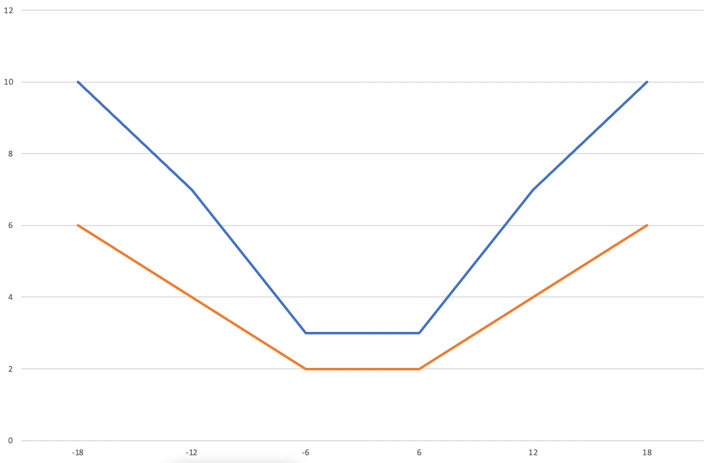
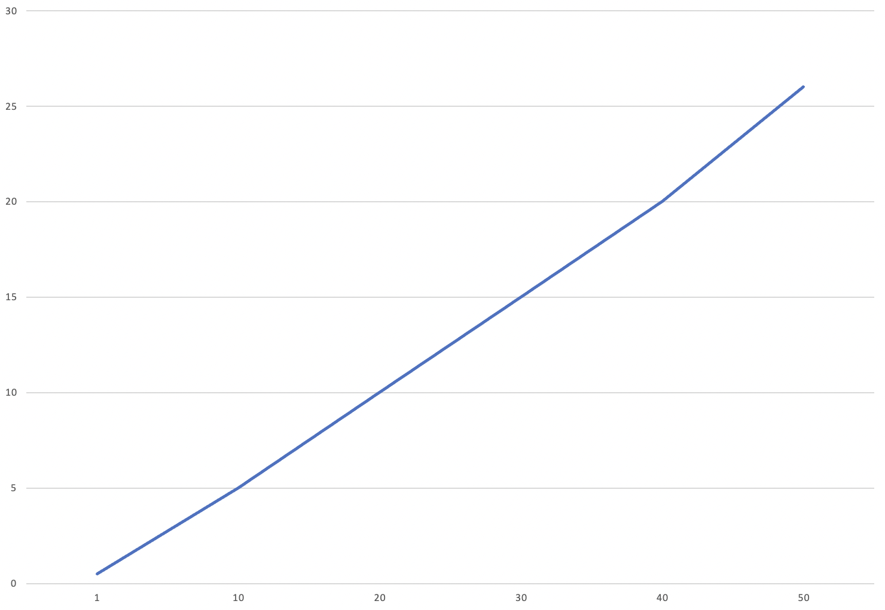

<h1>Імітаційне моделювання комп'ютерних систем</h1>

<h2>Лабораторна робота №1. Опис імітаційних моделей</h2>

<h3>СПм-21-2, Понамарьов Владислав Олександрович</h3>

<h2>Модель:
<a href="https://www.netlogoweb.org/launch#https://www.netlogoweb.org/assets/modelslib/Curricular%20Models/CT-STEM/Pendulum.nlogo">
Pendulum
</a>
</h2>

<h3>Опис моделі:</h3>

Модель призначена для того, щоб зрозуміти гармонійний рух, досліджуючи рух маятника та спостерігаючи за змінами
пов'язаних із налаштуванням параметрів, таких як зміщення, прискорення швидкості. Крім того, можна спостерігати за
змінами механіко-кінетичної та потенційної енергії маятника, а також за тим, як зберігається повна енергія під час руху
маятника. Модель показує простий маятник з малим кутом відхилення у простому гармонійному русі. Можна змінити кут
випуску та довжину маятника, щоб спостерігати за змінами у русі.

<h4>Керуючі параметри:</h4>
<ul>
<li>release-angle (кут випуску маятника).</li>
<li>length-of-pendulum (довжина маятника).</li>
<li>mass-of-bob (маса шара)</li>
</ul>

<h4>Внутрішні параметри:</h4>
<ul>
<li>kinetic-energy (кінетична енергія).</li>
<li>potential-energy (потенційна енергія).</li>
<li>potential-energy (загальна енергія).</li>
<li>distance-from-the-mean-position (відстань від середнього положення).</li>
<li>velocity (швидкість).</li>
<li>acceleration (прискорення).</li>
</ul>

<h4>Критерії ефективності системи:</h4>
<ul>
<li>кінетична енергія маятника.</li>
<li>потенційна енергія маятника.</li>
<li>загальна енергія маятника.</li>
<li>відстань від середнього положення маятника.</li>
<li>швидкість руху маятника.</li>
<li>прискорення маятника.</li>
</ul>

<h3>Обчислювальні експерименти</h3>

<h4>1. Вплив кута випуску маятника на середню швидкість та середнє прискорення</h4>

Залежність середньої швидкості та середнього прискорення маятника протягом 2000 тактів від кута випуску маятника. 
Зміна кута від -18 до 18 градусів, 6 експериментів з кроком 6.

<table>
<thead>
<tr>
<th>Кут</th>
<th>Швидкість</th>
<th>Прискорення</th>
</tr>
</thead>
<tbody>
<tr>
<td>-18</td>
<td>10</td>
<td>6</td>
</tr>
<tr>
<td>-12</td>
<td>7</td>
<td>4</td>
</tr>
<tr>
<td>-6</td>
<td>3</td>
<td>2</td>
</tr>
<tr>
<td>6</td>
<td>3</td>
<td>2</td>
</tr>
<tr>
<td>12</td>
<td>7</td>
<td>4</td>
</tr>
<tr>
<td>18</td>
<td>10</td>
<td>6</td>
</tr>
</tbody>
</table>

Чим ближче значення кута випуску маятника до 0, тим менше середня швидкість і середнє прискорення.

<h4>2. Вплив довжини маятника на відстань від середнього положення</h4>

Залежність відстані від середнього положення маятника протягом 2000 тактів від довжини маятника.
Зміна довжини від 1 до 50 одиниць, 6 експериментів з кроком 10.

<table>
<thead>
<tr>
<th>Довжина</th>
<th>Відстань</th>
</tr>
</thead>
<tbody>
<tr>
<td>1</td>
<td>0.5</td>
</tr>
<tr>
<td>10</td>
<td>5</td>
</tr>
<tr>
<td>20</td>
<td>10</td>
</tr>
<tr>
<td>30</td>
<td>15</td>
</tr>
<tr>
<td>40</td>
<td>20</td>
</tr>
<tr>
<td>50</td>
<td>26</td>
</tr>
</tbody>
</table>

Чим довше маятник, тим більша відстань від середнього становища.

<h4>3. Вплив маси кулі на максимальну кінетичну та потенційну енергію</h4>

Залежність максимальної кінетичної та потенційної енергії протягом 2000 тактів від ваги кулі.
Зміна маси від 1 до 100 одиниць, 6 експериментів з кроком 20.

<table>
<thead>
<tr>
<th>Маса</th>
<th>Швидкість</th>
<th>Прискорення</th>
</tr>
</thead>
<tbody>
<tr>
<td>1</td>
<td>34</td>
<td>34</td>
</tr>
<tr>
<td>20</td>
<td>670</td>
<td>670</td>
</tr>
<tr>
<td>40</td>
<td>1340</td>
<td>1340</td>
</tr>
<tr>
<td>60</td>
<td>2020</td>
<td>2020</td>
</tr>
<tr>
<td>80</td>
<td>2680</td>
<td>2680</td>
</tr>
<tr>
<td>100</td>
<td>3360</td>
<td>3360</td>
</tr>
</tbody>
</table>

Чим більша маса маятника, тим більша кінетична та потенційна енергія.

