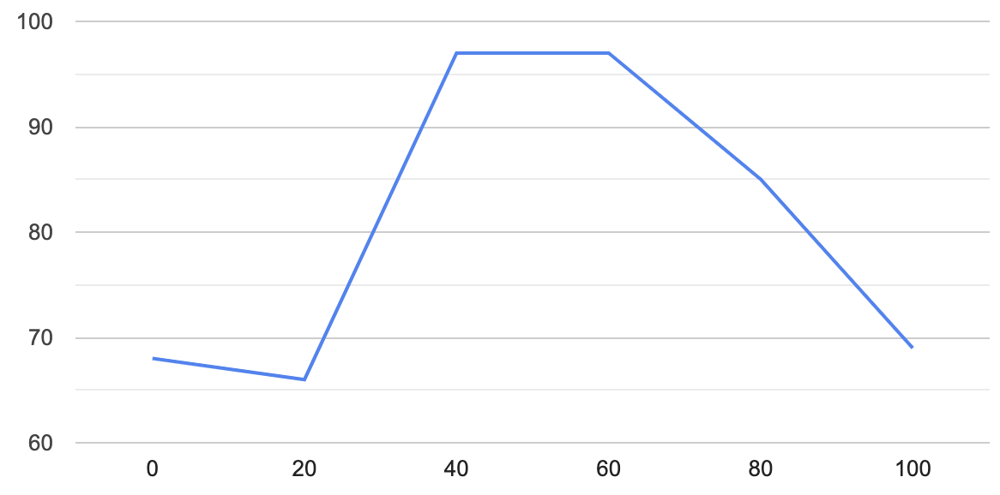

<h1>Імітаційне моделювання комп'ютерних систем</h1>

<h2>Лабораторна робота №1. Опис імітаційних моделей (Повторно)</h2>

<h3>СПм-21-2, Понамарьов Владислав Олександрович</h3>

<h2>Модель:
<a href="https://www.netlogoweb.org/launch#http://www.netlogoweb.org/assets/modelslib/Sample%20Models/Biology/Autumn.nlogo">
Autumn
</a>
</h2>

<h3>Опис моделі:</h3>

Модель імітує те, як листя змінює свої кольори та опадає, що дає змогу дослідити та зрозуміти це щорічне видовище.

<h4>Керуючі параметри:</h4>
<ul>
<li>number-of-leaves (кількість листя).</li>
<li>start-sugar-mean (среднее значение сахара в листях на початку).</li>
<li>start-sugar-stddev (стандартне відхилення значення цукру в листі на початку)</li>
<li>temperature (температура)</li>
<li>rain-intensity (інтенсивність дощу)</li>
<li>wind-factor (вітровий фактор</li>
<li>sun-intensity (інтенсивність сонця)</li>
<li>leaf-display-mode (режим відображення листя)</li>
</ul>

<h4>Внутрішні параметри:</h4>
<ul>
<li>leaves (листя).</li>
<li>dead leaves (мертве листя).</li>
<li>temperature (температура).</li>
<li>rain (дощ).</li>
<li>wind (вітер).</li>
<li>sunlight (сонячне світло).</li>
<li>chlorophyll (хлорофіл в листях).</li>
<li>water (води в листях).</li>
<li>sugar (цукор в листях).</li>
<li>carotene (каротин в листях).</li>
<li>anthocyanin (антоціан в листях).</li>
<li>attachedness (прихильність).</li>
</ul>

<h4>Критерії ефективності системи:</h4>
<ul>
<li>кількість живого листя.</li>
<li>кількість мертвого листя.</li>
<li>погодні умови.</li>
<li>значення речовин у листі.</li>
</ul>

<h3>Обчислювальні експерименти</h3>

<h4>1. Вплив температури на відмирання листя</h4>

Зміна темпаратури від 0 до 40 градусів, 6 експериментів з кроком 8.

<table>
<thead>
<tr>
<th>Температура</th>
<th>Такти</th>
</tr>
</thead>
<tbody>
<tr>
<td>0</td>
<td>65</td>
</tr>
<tr>
<td>8</td>
<td>67</td>
</tr>
<tr>
<td>16</td>
<td>72</td>
</tr>
<tr>
<td>24</td>
<td>74</td>
</tr>
<tr>
<td>32</td>
<td>74</td>
</tr>
<tr>
<td>40</td>
<td>52</td>
</tr>
</tbody>
</table>

Чим більше значення температури, тим більше тактів потрібно для повного відмирання листя, але при маскісмальній температурі відмирання відбувається найшвидше.

<h4>2. Вплив вітру на відмирання листя</h4>

Зміна вітру від 1 до 10 одиниць, 6 експериментів з кроком 2.

<table>
<thead>
<tr>
<th>Вітер</th>
<th>Такти</th>
</tr>
</thead>
<tbody>
<tr>
<td>1</td>
<td>189</td>
</tr>
<tr>
<td>2</td>
<td>97</td>
</tr>
<tr>
<td>4</td>
<td>54</td>
</tr>
<tr>
<td>6</td>
<td>47</td>
</tr>
<tr>
<td>8</td>
<td>34</td>
</tr>
<tr>
<td>10</td>
<td>28</td>
</tr>
</tbody>
</table>

При значенні вітру 0 листя не опадає, зі збільшенням рівня вітру кількість тактів повне опадання зменшується.

<h4>3. Вплив інтенсивності сонця на відмирання листя</h4>

Зміна інтенсивності сонця від 0% до 100%, 6 експериментів з кроком 20.

<table>
<thead>
<tr>
<th>Cонце</th>
<th>Такти</th>
</tr>
</thead>
<tbody>
<tr>
<td>0</td>
<td>68</td>
</tr>
<tr>
<td>20</td>
<td>66</td>
</tr>
<tr>
<td>40</td>
<td>97</td>
</tr>
<tr>
<td>60</td>
<td>97</td>
</tr>
<tr>
<td>80</td>
<td>85</td>
</tr>
<tr>
<td>100</td>
<td>69</td>
</tr>
</tbody>
</table>

При малої та великої інтенсивності сонця потрібно більше тактів для повного опадання листя, при середньому значенні інтенсивності сонця потрібно більше тактів для повного опадання листя.

