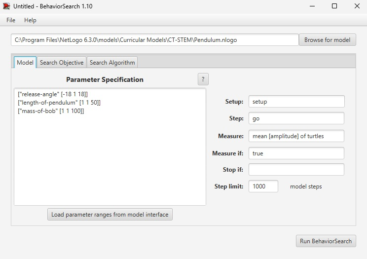
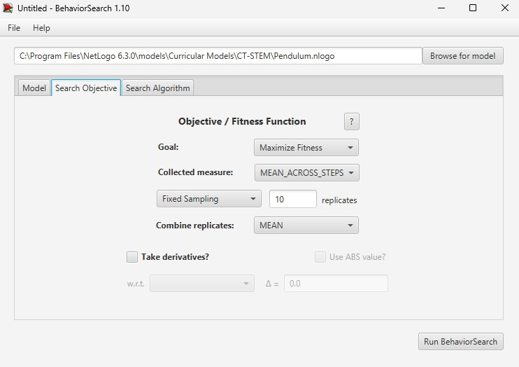
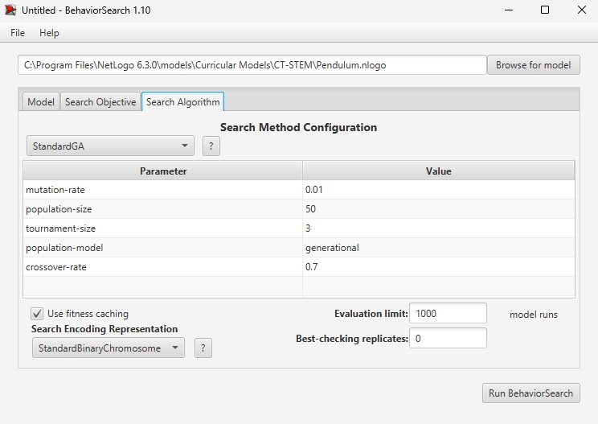
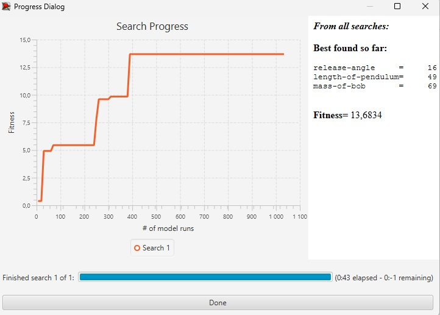
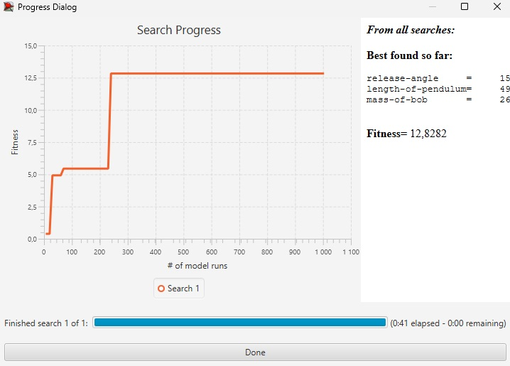

<h1>Імітаційне моделювання комп'ютерних систем</h1>

<h2>Лабораторна робота №3. Використання засобів обчислювального інтелекту для оптимізації імітаційних моделей</h2>

<h3>СПм-21-2, Понамарьов Владислав Олександрович</h3>

<h2>Модель:
<a href="https://www.netlogoweb.org/launch#https://www.netlogoweb.org/assets/modelslib/Curricular%20Models/CT-STEM/Pendulum.nlogo">
Pendulum
</a>
</h2>

<h3>Налаштування середовища BehaviorSearch:</h3>

<h4>Вибрана модель:</h4>
<pre>
C:\Program Files\NetLogo 6.3.0\models\Curricular Models\CT-STEM\Pendulum.nlogo
</pre>

<h4>Параметри моделі:</h4>

Параметри та їх передбачувані діапазони були автоматично вилучені середовищем BehaviorSearch із вибраної імітаційної моделі.

<pre>
["release-angle" [-18 1 18]]
["length-of-pendulum" [1 1 50]]
["mass-of-bob" [1 1 100]]
</pre>

<h4>Використовувана міра:</h4>

Для фітнес-функції було вибрано значення амплітуди маятника та вказано у параметрі "Measure".

<pre>
mean [amplitude] of turtles
</pre>

<h4>Налаштування параметрів:</h4>

Амплітуда враховується за період симуляції тривалістю 1000 тактів, починаючи з 0 такту симуляції.

<h4>Налаштування цільової функції:</h4>

Метою підбору параметрів імітаційної моделі, що описує коливання маятника, є максимізація значення амплітуди – це зазначено через параметр "Goal" зі значенням "Maximize Fitness".

<h4>Налаштування алгоритму пошуку:</h4>

Для цих алгоритмів, що вирішують завдання пошуку такого набору параметрів імітаційної моделі, щоб задовольнити вимоги завдання, необхідно вказати "Evaluation limit" та "Search Space Encoding Representation".

<h3>Результати використання середовища BehaviorSearch:</h3>

<h4>Результат пошуку параметрів імітаційної моделі, використовуючи генетичний алгоритм:</h4>

<h4>Результат пошуку параметрів імітаційної моделі, використовуючи випадковий пошук:</h4>
